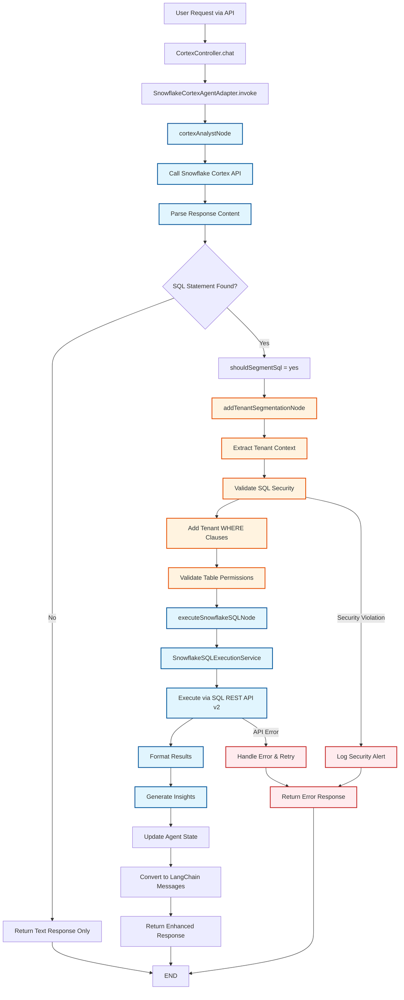
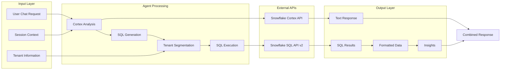
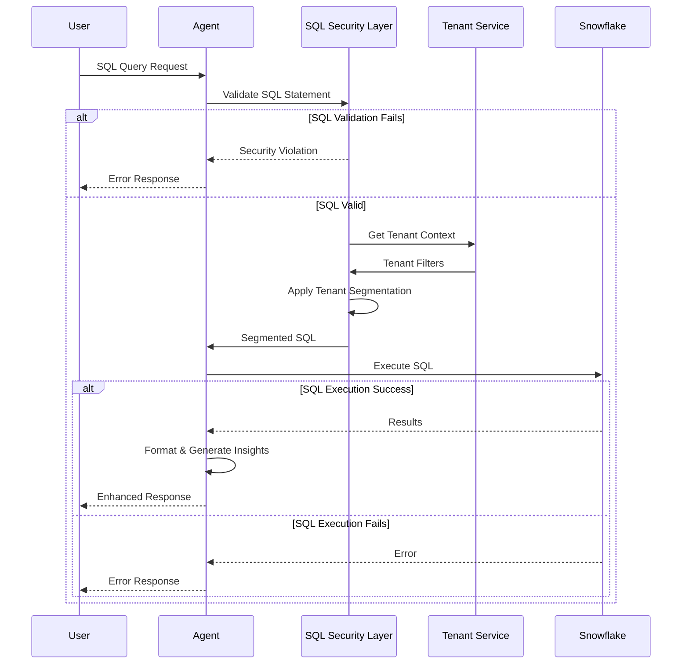
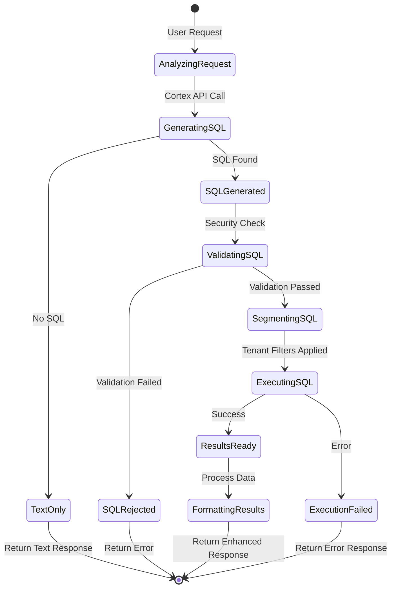

# Snowflake SQL Execution Workflow

## Complete Agent Workflow

The following diagram illustrates the enhanced Snowflake Cortex agent workflow with SQL execution capabilities:

## Data Flow Architecture

## Security Flow

## State Transitions

## Component Integration

The implementation integrates with existing Flicket Agent Platform components:

### 1. Authentication Flow
- Uses existing JWT authentication via `SnowflakeJwtService`
- Leverages HTTP interceptors for automatic token refresh
- Maintains secure API communication

### 2. Agent Orchestration
- Integrates with LangGraph state management
- Follows existing agent pattern with ports/adapters
- Supports multi-agent workflows through orchestration module

### 3. Configuration Management
- Extends existing config system for SQL execution settings
- Supports environment-specific configurations
- Includes feature flags for gradual rollout

### 4. Error Handling & Monitoring
- Uses NestJS logging infrastructure
- Integrates with existing health check endpoints
- Supports metrics collection for observability

## Implementation Phases

### Phase 1: Core SQL Execution (2-3 days)
- Implement `SnowflakeSQLExecutionService`
- Create basic SQL validation
- Add Snowflake API v2 integration
- Implement `executeSnowflakeSQLNode`

### Phase 2: Security & Tenant Isolation (2-3 days)
- Implement SQL parsing and validation
- Add tenant segmentation logic
- Create security audit logging
- Implement `addTenantSegmentationNode`

### Phase 3: Response Enhancement (1-2 days)
- Update message conversion logic
- Add result formatting and insights generation
- Implement data visualization helpers
- Enhanced error messaging

### Phase 4: Testing & Monitoring (2-3 days)
- Create comprehensive unit tests
- Add integration tests with Snowflake
- Implement performance monitoring
- Security penetration testing

### Phase 5: Documentation & Deployment (1 day)
- Update API documentation
- Create usage guides
- Deploy to staging environment
- Performance tuning

This workflow design ensures secure, scalable, and maintainable SQL execution capabilities while maintaining the existing agent architecture and security principles.